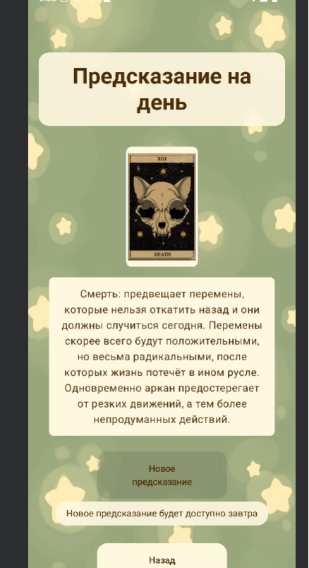

# МЯУкающие карты
## 📱Описание
Ваш ежедневный гид по звёздам и тайнам Таро!
Погрузитесь в мир астрологии, магии и пушистых котиков!
Наше современное Android-приложение объединяет гороскопы, гадания на картах Таро и коллекцию удивительных фактов о котах — всё для вашего вдохновения и хорошего настроения.
## 📸Скриншоты

## Используемые технологии
UX & UI
- Jetpack Compose — современный UI toolkit для Android
- Material Design 3 — динамичные цвета и стиль
- Navigation Compose — удобная навигация между экранами

Архитектура & Управление состоянием
- MVVM + Clean Architecture — четкое разделение слоев
- Hilt — внедрение зависимостей
- Coroutines & Flow — асинхронная загрузка данных
- StateFlow — управление состоянием UI

База данных
- Room Database — локальное хранение гороскопов и карт Таро

Дополнительные библиотеки
- Retrofit, OkHttp, Gson — сетевые запросы и обработка данных
- Material Icons Extended — красивые иконки

## Настройка и установка
Требования:
- Android 10 и выше
- Kotlin 1.9+
- JDK 11
  
Сборка и запуск:
- Клонируйте репозиторий
- Откройте проект в Android Studio
- Запустите сборку и установите приложение на устройство или эмулятор

## Функционал
Гороскопы
- ✅  Ежедневные гороскопы по знакам зодиака
- ✅  Подробные описания и советы

Карты Таро
- ✅  Значения и толкования
- 🕛  Генерация случайной карты дня

Факты о котах
- ✅ Случайные и тематические факты

Настройки
- ✅ Темная/светлая тема
- ✅ Персонализация интерфейса

## Архитектура
Приложение построено на MVVM + Clean Architecture для удобства поддержки и масштабирования.

📦 Presentation Layer (UI)
-  🖥️ Composables (Jetpack Compose UI)
-  🎯 ViewModels (UI State Management)
-   � Navigation (Screen Navigation)

📦 Domain Layer (Business Logic)
- 🎯 Use Cases (Business Operations)
-  📋 Entities (Domain Models)
-   🔌 Repository Interfaces

📦 Data Layer (Data Management)
- 🗄️ Repositories (Data Sources Orchestration)
- 💾 Local DataSource (Room Database)
- 🔄 Synchronization (Offline-First)

## Будущие улучшения
- 📤 Push-уведомления о новых гороскопах и фактах
- 📤 Интеграция с календарем устройства
-  📤 Мультиязычная поддержка
-  📤 Расширение раздела Таро (расклады, советы)
-  📤 Новые коллекции фактов и иллюстраций

## Авторы
- 👨‍💻 Elizaveta Burhanova
📧 Email: elizavetaborhanova4@gmail.com
🐱 GitHub: elizaveta678

- 👨‍💻 Daria Drugova
📧 Email: platinovman@gmail.com
📱 Telegram: @chhmonuua

# Сделано с ❤️ для всех, кто верит в магию и любит котиков!
